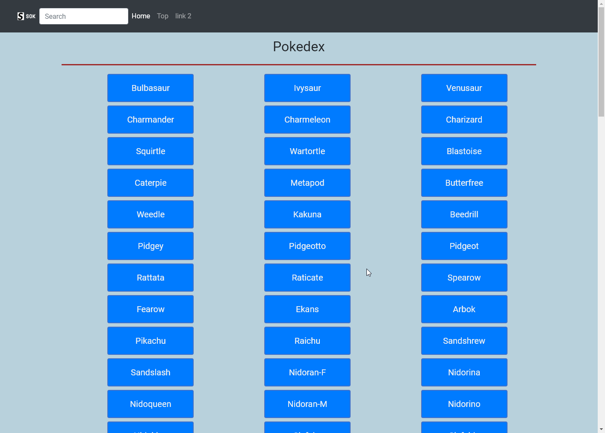

# Pokedex App

## About
This application uses HTML, CSS, and Javascript to load pokemon data from an external API. By clicking on one of the generated buttons, a modal appears displaying features such as the pokemon's weight, height, and abilities. Pokemon can be filtered out through the search bar at the top left.

## Dependencies
* jQuery
* Bootstrap

###### Author
@SolidSok